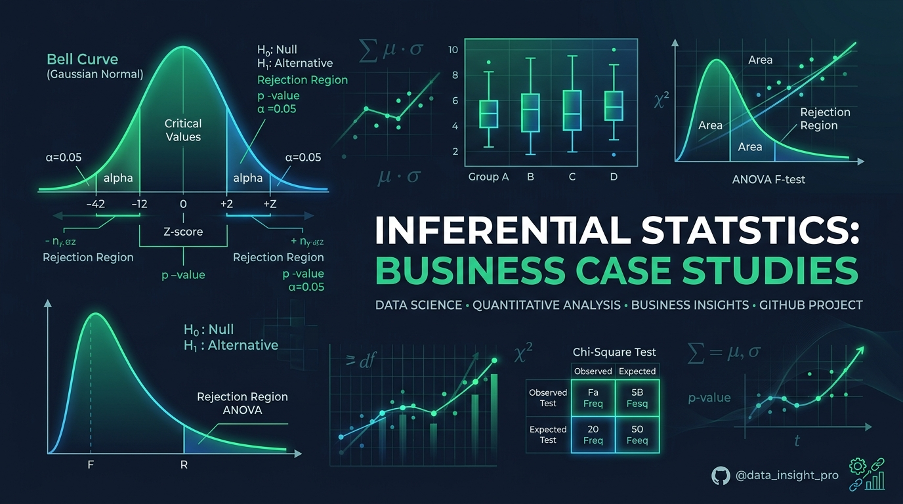
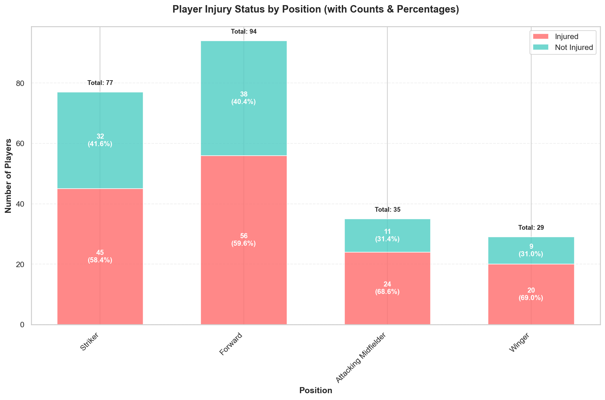
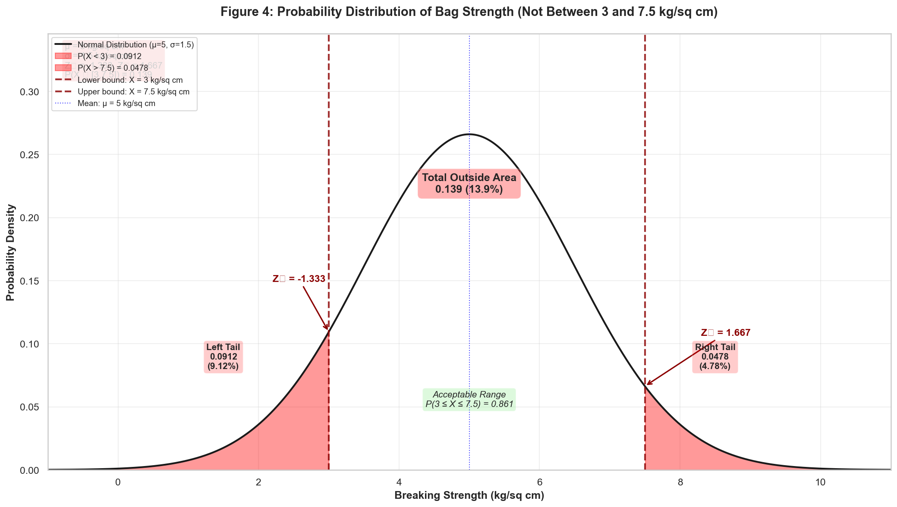
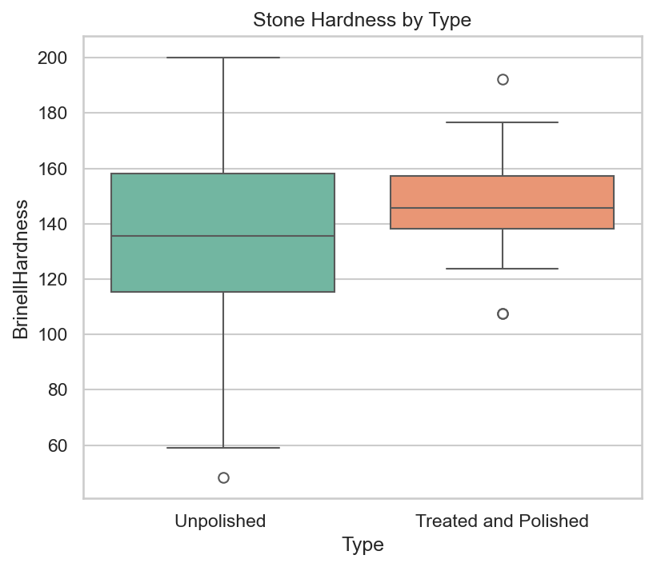
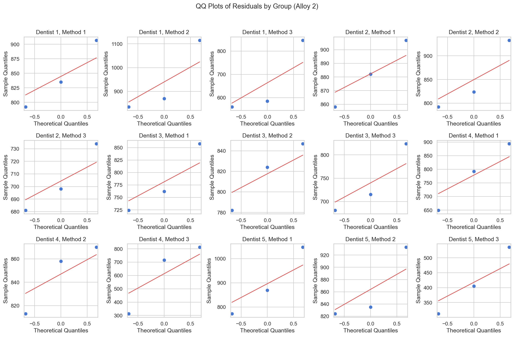

# 📊 Inferential Statistics — Multiple Case Studies

[](https://www.python.org/)
[](https://jupyter.org/)
[](#-evaluation)
[](#-about-this-project)
[](LICENSE)

> **Part of PGP in Data Science (2025) — Inferential Statistics module.**  
> Four real-world business problems solved using probability theory, normal distribution analysis, hypothesis testing, and ANOVA. Scored **60/60**.

<p align="center">
  
</p>

---

## 📋 Table of Contents

- [About This Project](#-about-this-project)
- [Case Studies Overview](#-case-studies-overview)
- [Key Results](#-key-results)
- [Repository Structure](#-repository-structure)
- [Tech Stack](#-tech-stack)
- [How to Reproduce](#-how-to-reproduce)
- [Evaluation](#-evaluation)
- [Future Improvements](#-future-improvements)

---

## 🎯 About This Project

This project was submitted as part of the **Inferential Statistics** module in the **PGP in Data Science (2025)** programme. It demonstrates the application of core statistical inference techniques to four distinct business domains:

| Domain | Technique |
|--------|-----------|
| Sports analytics (football injuries) | Probability theory |
| Manufacturing quality control (cement packaging) | Normal distribution & Z-scores |
| Industrial quality assurance (stone printing) | Hypothesis testing (t-tests) |
| Healthcare optimization (dental implants) | ANOVA & post-hoc analysis |

The deliverables are:
- 📓 **[Jupyter Notebook](notebooks/inferential_statistics_analysis.ipynb)** — all code, computations, and statistical outputs
- 📄 **[Business Report](reports/business_report.pdf)** — a code-free managerial report with findings, visuals, and actionable recommendations

---

## 📁 Case Studies Overview

### Problem 1 — Football Player Injuries (Probability)

**Business Context:** A physiotherapist wants to understand the risk of foot injuries by player position in a male football team (235 players).

**Techniques:** Marginal probability, Addition rule, Joint probability, Conditional probability (Bayes)

| Question | Answer |
|----------|--------|
| P(player is injured) | **61.7%** |
| P(Forward OR Winger) | **52.3%** |
| P(Striker AND Injured) | **19.1%** |
| P(Striker \| Injured) | **31.0%** |

<p align="center">
  
</p>

**Key Finding:** Strikers and Forwards bear the highest injury burden. Targeted prevention programs for these positions are recommended.

---

### Problem 2 — Cement Packaging Quality (Normal Distribution)

**Business Context:** A cement company needs to understand the breaking-strength distribution of their gunny bag packaging to minimize supply chain losses.

**Given:** Breaking strength ~ Normal(μ = 5 kg/cm², σ = 1.5 kg/cm²)

**Techniques:** Normal CDF, Z-scores, Complement rule, Two-tailed probability

| Question | Probability |
|----------|-------------|
| P(strength < 3.17 kg/cm²) | **11.1%** |
| P(strength ≥ 3.6 kg/cm²) | **82.5%** |
| P(5 ≤ strength ≤ 5.5 kg/cm²) | **13.1%** |
| P(strength NOT between 3 and 7.5) | **13.9%** |

<p align="center">
  
</p>

**Key Finding:** ~11% of bags fall below safe breaking strength. Strengthening supplier specifications and implementing incoming quality control (IQC) is recommended.

---

### Problem 3 — Zingaro Stone Printing (Hypothesis Testing)

**Business Context:** Zingaro must achieve a Brinell Hardness Index (BHI) of ≥150 for optimal stone printing. A batch of polished and unpolished stones has been received.

**Dataset:** [`data/zingaro_company.csv`](data/zingaro_company.csv) — 76 observations

**Techniques:** One-sample t-test (left-tailed), Two-sample Welch t-test, Shapiro-Wilk normality test

| Test | H₀ | Result | Conclusion |
|------|----|--------|------------|
| 3.1: Unpolished stones suitable? | μ ≥ 150 | **Rejected** (p < 0.05) | Unpolished stones are NOT suitable |
| 3.2: Equal mean hardness? | μ_polished = μ_unpolished | **Rejected** (p < 0.05) | Hardness is significantly different |

<p align="center">
  
</p>

**Key Finding:** Zingaro is justified in rejecting unpolished stone batches. Separate QA protocols for polished vs. unpolished materials are recommended.

---

### Problem 4 — Dental Implant Hardness (ANOVA)

**Business Context:** Dental implant hardness is affected by dentist, implantation method, alloy type, and temperature. Identifying key factors enables standardization.

**Dataset:** [`data/dental_hardness_data.xlsx`](data/dental_hardness_data.xlsx) — 90 observations (3 Dentists × 3 Methods × 2 Alloys)

**Techniques:** One-Way ANOVA, Two-Way ANOVA, Tukey HSD post-hoc, Shapiro-Wilk, Levene's test, Interaction plots, Residual diagnostics

#### Results Summary

| Factor | Alloy 1 | Alloy 2 |
|--------|---------|---------|
| **4.1** Dentist effect (One-Way ANOVA) | Not significant (p > 0.05) | Not significant (p > 0.05) |
| **4.2** Method effect (One-Way ANOVA) | **Significant** (p < 0.05) | **Significant** (p < 0.05) |
| **4.3** Dentist × Method interaction | **Significant interaction** | **Significant interaction** |
| **4.4** Two-Way ANOVA (joint effect) | Dentist ✓, Method ✓, Interaction ✓ | Dentist ✗, Method ✓, Interaction ✓ |

Post-hoc (Tukey HSD): **Method 3 is significantly different** from Methods 1 & 2 for both alloys.

<p align="center">
  
</p>

**Key Finding:** Implantation method is the primary driver of hardness variation. Method 3 consistently underperforms. Dentist-method pairing protocols should be standardized, especially for Alloy 1.

---

## 📂 Repository Structure

```
inferential-statistics-case-studies/
├── README.md                          # This file
├── LICENSE                            # MIT License
├── requirements.txt                   # Python dependencies
├── .gitignore
│
├── data/
│   ├── zingaro_company.csv            # Stone hardness data (Problem 3)
│   ├── dental_hardness_data.xlsx      # Dental implant data (Problem 4)
│   ├── problem1_football_injuries.txt # Contingency table (Problem 1)
│   └── problem2_gunny_bags.txt        # Distribution parameters (Problem 2)
│
├── notebooks/
│   └── inferential_statistics_analysis.ipynb  # Full analysis
│
├── reports/
│   ├── business_report.pdf            # Submitted business report (65 pages)
│   └── business_report.docx           # Editable source
│
├── images/                            # All generated plots (18 figures)
│   ├── p1_*.png                       # Problem 1 visuals
│   ├── p2_*.png                       # Problem 2 visuals
│   ├── p3_*.png                       # Problem 3 visuals
│   └── p4_*.png                       # Problem 4 visuals
│
└── docs/
    └── problem_statement.md           # Problem statements, rubric & scores
```

---

## 🛠 Tech Stack

| Tool | Purpose |
|------|---------|
| **Python 3.10+** | Core language |
| **NumPy** | Numerical computing |
| **Pandas** | Data manipulation |
| **SciPy** (`stats`) | Statistical tests (t-test, ANOVA, Shapiro, Levene) |
| **Statsmodels** | ANOVA (`anova_lm`), Tukey HSD, OLS |
| **Matplotlib** | Visualizations (normal PDF/CDF, bar charts, QQ plots) |
| **Seaborn** | Statistical plots (boxplots, heatmaps) |
| **Jupyter Notebook** | Interactive development environment |

---

## ▶ How to Reproduce

### Prerequisites

```bash
git clone https://github.com/Souhrid-Dey/inferential-statistics-case-studies.git
cd inferential-statistics-case-studies
pip install -r requirements.txt
```

### Run the Notebook

```bash
jupyter notebook notebooks/inferential_statistics_analysis.ipynb
```

Or execute all cells non-interactively:

```bash
jupyter nbconvert --to notebook --execute --inplace notebooks/inferential_statistics_analysis.ipynb
```

> **Note:** All figures will be saved to the `images/` directory automatically.

---

## 🏆 Evaluation

This project was assessed as part of the **PGP in Data Science — Inferential Statistics** module.

| Criteria | Max Marks | Scored |
|----------|-----------|--------|
| 1.1 P(randomly chosen player injured) | 1 | **1** |
| 1.2 P(Forward OR Winger) | 1 | **1** |
| 1.3 P(Striker AND Injured) | 2 | **2** |
| 1.4 P(Striker \| Injured) | 2 | **2** |
| 2.1 P(strength < 3.17) | 1 | **1** |
| 2.2 P(strength ≥ 3.6) | 1 | **1** |
| 2.3 P(5 ≤ strength ≤ 5.5) | 2 | **2** |
| 2.4 P(NOT between 3 and 7.5) | 2 | **2** |
| 3.1 One-sample t-test (unpolished stones) | 4 | **4** |
| 3.2 Two-sample t-test (polished vs unpolished) | 4 | **4** |
| 4.1 One-Way ANOVA — Dentist effect | 10 | **10** |
| 4.2 One-Way ANOVA — Method effect | 10 | **10** |
| 4.3 Interaction plots | 4 | **4** |
| 4.4 Two-Way ANOVA | 10 | **10** |
| Quality of Business Report | 6 | **6** |
| **Total** | **60** | **60 ✅** |

### Evaluator Comments
- *"Correctly identified total injured and total players. Probability calculation is accurate and clearly presented."*
- *"Null and alternate hypotheses are clearly stated. P-value interpretation supports a justified conclusion."*
- *"Separate ANOVA for each alloy is correctly done. Assumptions and conclusions are clearly addressed."*
- *"Report is well-structured and logically organized. Visuals are clear, and code is excluded as required."*

---

## 🔮 Future Improvements

- [ ] Embed interaction plots for Alloy 1 (to complement Alloy 2 QQ plots)
- [ ] Add confidence intervals to the football injury probability estimates
- [ ] Add effect size (Cohen's d) summary table for all hypothesis tests
- [ ] Build an interactive Streamlit or Gradio dashboard for the Normal distribution visualizations
- [ ] Extend Problem 4 with mixed-effects models incorporating the `Temp` variable
- [ ] Add Chi-square test for independence to Problem 1 to test position-injury association formally

---

## 📄 License

This project is licensed under the MIT License — see the [LICENSE](LICENSE) file for details.

The datasets and analysis code are free to use for educational and research purposes.

> **Note:** Institute-provided guidelines and sample solutions are proprietary and are not included in this repository.

---

<p align="center">
  Made with 📊 and Python by <a href="https://github.com/Souhrid-Dey">Souhrid Dey</a>
</p>
